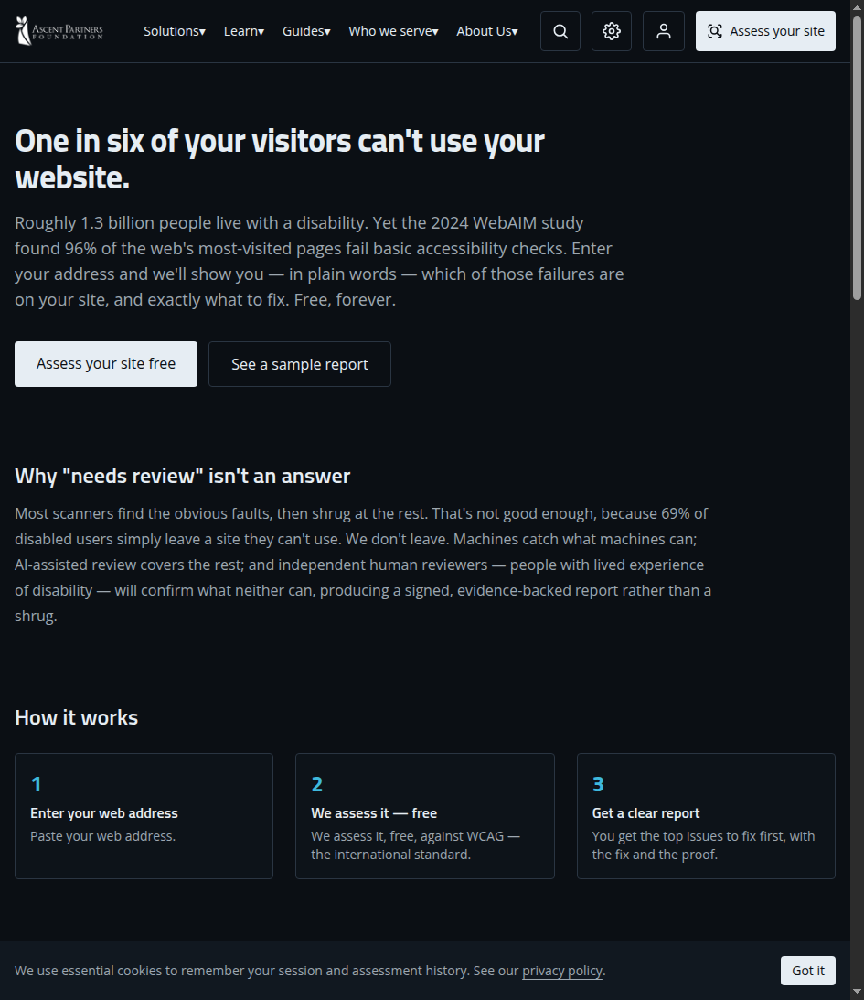
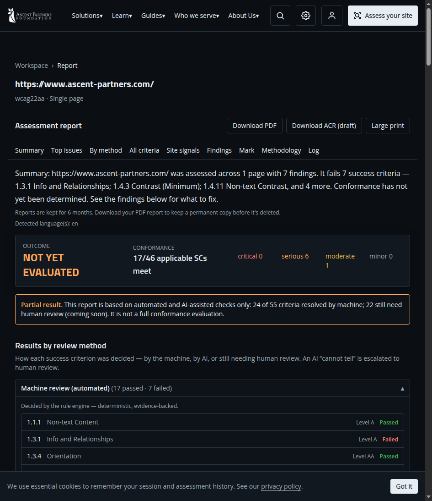

# Ascent Accessibility

**Is your website accessible? Find out — free, in about a minute.**

An open-source web accessibility assessment platform by
[Ascent Partners](https://www.ascent.partners). Paste a domain, and we crawl your
site, run an in-house accessibility engine in a headless browser, and return a
**WCAG 2.2 score**, the failures, plain-language fixes, and an evidence-backed
**PDF report** — plus a free training course.

[](https://github.com/simonplmak-cloud/ascent-accessibility/releases)
[](LICENSE)
[](https://github.com/simonplmak-cloud/ascent-accessibility/actions)
[](https://github.com/simonplmak-cloud/ascent-accessibility/stargazers)

▶ **Try it now:** <https://accessibility.ascent.partners>



## Why this exists

Roughly **1.3 billion people** live with a disability, and the 2024 WebAIM study
found **96% of the web's most-visited pages fail basic accessibility checks**.
Most scanners find the obvious faults, then shrug at the rest. We don't.

- **Machines** catch what machines can (deterministic, evidence-backed rules).
- **AI-assisted review** covers the machine-untestable criteria — with a hard
  confidence gate, never a guessed pass.
- **Human review** (people with lived experience of disability) resolves what
  neither can — with a clear, per-criterion "why AI can't decide this".

## What you get

- ✅ WCAG 2.0 / 2.1 / 2.2 + Section 508 scoring, per-criterion verdicts
- ✅ Findings with evidence screenshots + a **PDF report**
- ✅ A clear "top issues to fix first" (ranked by impact × reach)
- ✅ **AI-assisted review** with confidence scores + reasoning
- ✅ **Page-language detection** (en / zh-Hant / zh-Hans) and locale-aware reasoning
- ✅ A **REST API** + API keys for programmatic use
- ✅ A free, structured **training course** with a PDF certificate
- ✅ Self-hostable — bring-your-own SurrealDB + a Linux box



## Quickstart

```bash
git clone https://github.com/simonplmak-cloud/ascent-accessibility.git
cd ascent-accessibility
pnpm install
cp .env.example .env.local   # set the SURREAL_* vars at minimum
pnpm db:migrate
pnpm dev
```

Self-host the scan worker + Browserless too — see
[`docs/self-hosting.md`](docs/self-hosting.md).

## Architecture

Split, DB-as-queue deployment — no background work on the serverless edge:

- **Web app** — Next.js 15 (App Router), TypeScript, Tailwind. Marketing + API
  only; `POST /api/v1/assessments` enqueues a job and returns `202`.
- **SurrealDB** — the job store; `assessment.status` (`queued → running →
  completed/failed`) *is* the queue.
- **Worker** (`src/worker/index.ts`) — polls SurrealDB, runs
  `runAssessment` (crawl → scan → score → persist), renders the PDF.
- **Browserless** — the headless Chromium, co-located with the worker.

The accessibility engine (`src/lib/engine`) is a **clean-room, in-house** rules
engine — no third-party accessibility engine (axe-core, etc.).

See [`docs/architecture/`](docs/architecture/) for the design decisions (ADRs) and
the [Wiki](https://github.com/simonplmak-cloud/ascent-accessibility/wiki) for
architecture, self-hosting, API reference, and configuration guides.

## Stack

- **Framework:** Next.js 15, TypeScript (strict), Tailwind
- **Engine:** in-house clean-room accessibility rules (`src/lib/engine`)
- **Browser:** Playwright + Browserless (`chromium.connectOverCDP`)
- **Database:** SurrealDB (`SCHEMAFULL`, DB-as-queue)
- **Auth:** SurrealDB native — email magic-link + Google OAuth
- **Payments:** Stripe (subscriptions + donations)
- **Reports:** react-pdf (PDF only)

## Scripts

| Command | Purpose |
|---------|---------|
| `pnpm dev` | Start the dev server |
| `pnpm check` | Type-check (`tsc --noEmit`) |
| `pnpm lint` | Lint (eslint) |
| `pnpm test` | Unit tests (Vitest) |
| `pnpm test:e2e` | Playwright E2E (needs a running app) |
| `pnpm build` | Production build |
| `pnpm worker:build` | Bundle the worker (`dist/worker.js`) |
| `pnpm db:migrate` | Apply the SurrealDB schema |

## API

| Method | Path | Description |
|--------|------|-------------|
| POST | `/api/v1/assessments` | Enqueue an assessment (returns `202`) |
| GET | `/api/v1/assessments` | List your assessments |
| GET | `/api/v1/assessments/:id` | Fetch status / report |
| DELETE | `/api/v1/assessments/:id` | Delete an assessment |
| GET | `/api/v1/assessments/:id/export?format=pdf` | Download the PDF report |
| POST | `/api/v1/api-keys` | Issue an API key (raw key returned once) |
| GET | `/api/v1/api-keys` | List keys (prefix only) |
| DELETE | `/api/v1/api-keys/:id` | Revoke a key |

Programmatic access uses `Authorization: Bearer <api-key>`.

## Environment variables

See [`.env.example`](.env.example) — the source of truth. Required at minimum:
`SURREAL_URL`, `SURREAL_USERNAME`/`SURREAL_PASSWORD` (or `SURREAL_TOKEN`),
`SURREAL_NAMESPACE`, `SURREAL_DATABASE`.

## Support this project

Ascent Accessibility is built by a registered charity. If it's useful, consider
[donating](https://accessibility.ascent.partners/donate) — and ⭐ this repo to
help others find it.

## Contributing

Contributions are welcome — see [`CONTRIBUTING.md`](CONTRIBUTING.md) and our
[`CODE_OF_CONDUCT.md`](CODE_OF_CONDUCT.md). Report security issues privately via
[`SECURITY.md`](SECURITY.md).

## License

[AGPL-3.0](LICENSE) — Ascent Partners Foundation.
