# Ascent Accessibility — Architecture

> **Status:** current (as-built). This is the authoritative, holistic architecture
> reference for the Ascent Accessibility WebApp. It supersedes any older diagrams
> that still reference third-party scanners (axe-core / IBM / Lighthouse) or a
> Fly.io worker — those have been replaced by the clean-room engine and a
> SWAS-hosted worker.

A web accessibility assessment platform. A visitor submits a domain and a standard
(WCAG 2.2 AA by default); the system crawls the site, runs an in-house accessibility
engine in a headless browser, and returns a conformance verdict, per-success-criterion
results, and evidence-backed findings — exportable as a **PDF-only** report, with
magic-link + Google/GitHub/Microsoft auth, Stripe subscriptions/donations, and a free
training path.

The defining traits of this architecture:

1. **Split, DB-as-queue** deployment — no background work on Vercel.
2. **Clean-room engine** — no third-party accessibility scanners in the scan path.
3. **Stateless auth** — HMAC-signed magic links and sessions; one email → one account.
4. **Machine + AI + human review** — deterministic rules, then BYOK AI, then a
   shrinking human-decision set.

---

## 1. System Context (C4 Level 1)

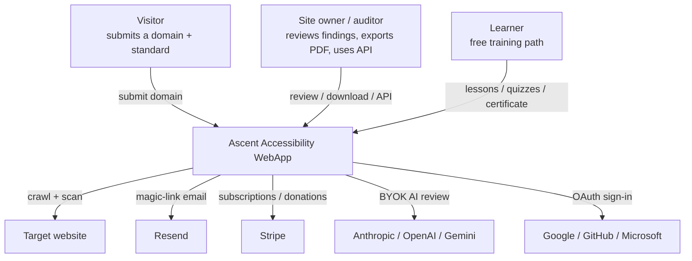

**Actors**

| Actor | Interaction |
|---|---|
| Visitor | submits a domain, chooses a standard, views the score/report |
| Site owner / auditor | reviews findings, downloads the PDF report, uses the API + API keys |
| Learner | free training path (lessons, quizzes, certificate) |

**External systems:** target websites (crawled/scanned), Resend (transactional email),
Stripe (payments), AI providers (Anthropic / OpenAI / Gemini, BYOK), and the OAuth
identity providers (Google / GitHub / Microsoft).

---

## 2. Container Architecture (C4 Level 2)

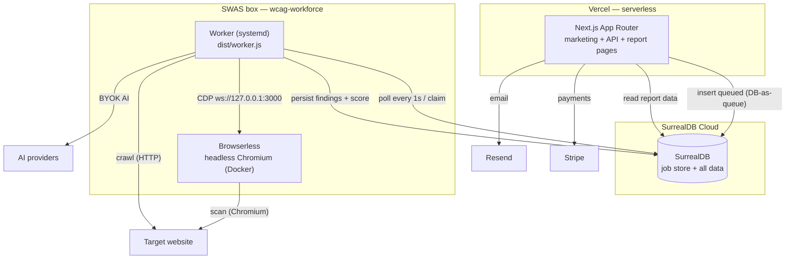

| Container | Role | Runtime |
|---|---|---|
| **Vercel** (Next.js App Router) | marketing site + API + report/history/api-keys pages | serverless — **never** crawls/scans |
| **SurrealDB** | job store (the `assessment.status` field *is* the queue) + findings/evidence/report data | SurrealDB Cloud |
| **Worker** | `dist/worker.js` (esbuild bundle) — polls `queued`, runs `runAssessment`, persists results | SWAS box, systemd |
| **Browserless** | headless Chromium for the engine scan, interaction scan, screenshots, and PDF export | Docker, co-located with the worker (`127.0.0.1:3000`) |
| **Stripe** | subscriptions + one-off donations | SaaS |
| **Resend** | magic-link email | SaaS |

The worker connects to Chromium over CDP via `chromium.connectOverCDP`; if
`BROWSERLESS_TOKEN` is unset it falls back to `chromium.launch()` (local dev).

---

## 3. Deployment Topology

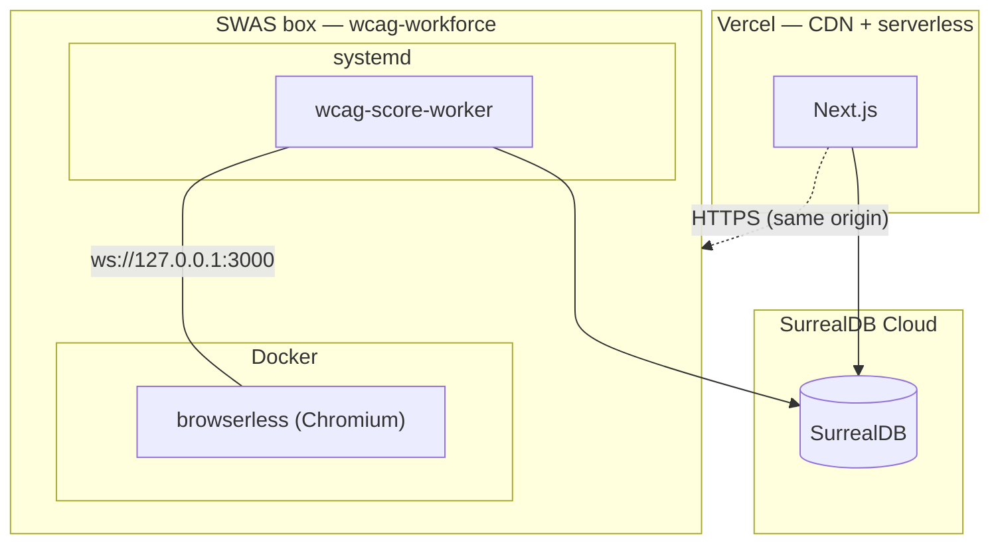

**Why DB-as-queue.** Vercel's serverless functions have no durable runtime, so no
background work runs there. The API endpoint only inserts a `queued` record and returns
`202`; the worker polls SurrealDB and does the heavy lifting. This keeps the scan path
off the request path entirely — a slow site never blocks an HTTP response.

**Worker lifecycle.** systemd keeps `wcag-score-worker` alive; a crash/reboot is
recovered by `recoverStaleRunning` (marks stale `running` records back to `queued`).

---

## 4. Assessment Lifecycle

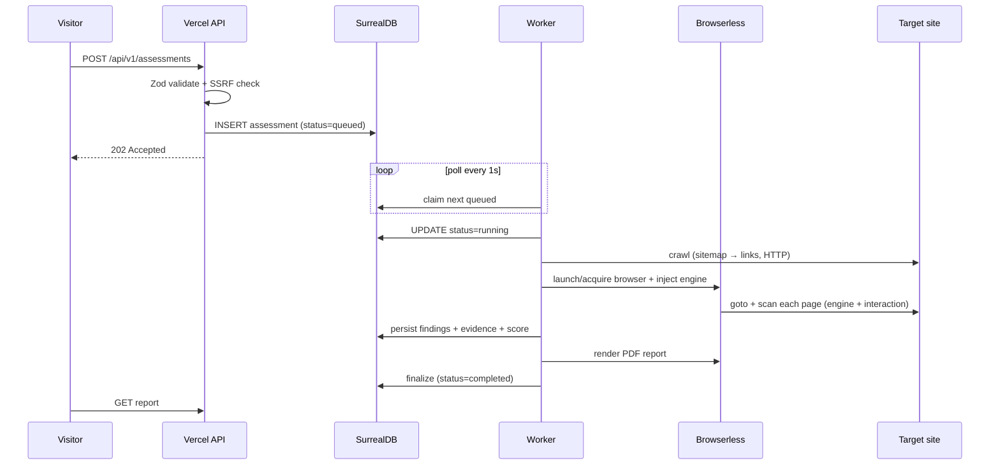

**Status state machine** (`assessment.status` *is* the queue):

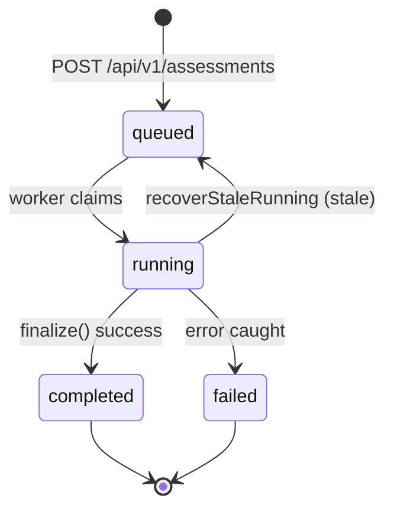

---

## 5. How a website is assessed (deep dive)

This is the authoritative walk-through of the assessment mechanics — from the
submitted URL to the persisted conformance result. The sections that follow
(6–9) expand on the individual stages at the module level.

### 5.1 Crawl & page discovery

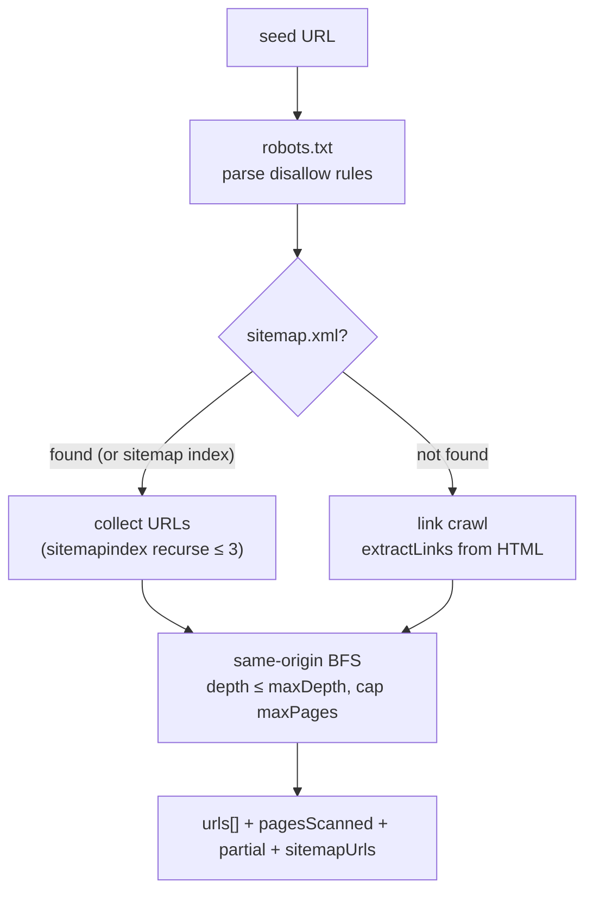

- **robots.txt** first (`parseRobotsDisallow`); every URL is filtered by
  `isAllowedByRobots`.
- **sitemap.xml** (`fetchSitemapUrls`) — handles `<sitemapindex>` (recursive, max
  depth 3) and `<loc>` entries. If any are found they seed the queue; otherwise the
  crawler falls back to link extraction (`extractLinks`).
- Bounded BFS: `maxDepth` (default 3), `maxPages` (default 100), same-origin only,
  a `visited` set, and a politeness delay (default `CRAWL_DELAY_MS ?? 200`).
- **Depth 0** = single-page scan — the crawl is skipped entirely.

### 5.2 Per-page engine evaluation

For every page, the worker acquires a pooled browser context, injects the
self-contained engine, navigates, and evaluates it in-page:

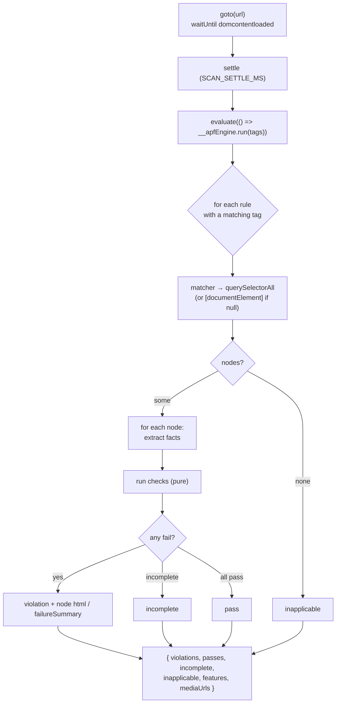

The in-page `run(tags)` loop, in full:

1. Build a `tagSet` from the selected standard's tags.
2. Skip any rule whose `tags` don't intersect the set.
3. `matcher` selects candidate nodes (or the whole document when `matcher` is null,
   for document-level rules such as `<html lang>`).
4. No matching nodes → the rule is recorded **inapplicable**.
5. For each node, `extract` pulls facts (a pure DOM snapshot); each `check` runs
   against those facts. The first failing check produces a **violation** node (with
   its `failureSummary` and a truncated outerHTML slice); otherwise **incomplete**
   nodes are collected.
6. Results are bounded: `MAX_NODES` (100) per violation, `MAX_BUCKET` (1000) per
   category.

### 5.3 Rule anatomy

Every rule is `matcher → extract (facts) → checks`. Concrete example (`image-alt`,
mapping to SC 1.1.1):

```ts
{
  id: "image-alt",
  impact: "critical",
  tags: ["wcag2a", "wcag111"],
  wcagSc: ["1.1.1"],
  matcher: "img",
  extract: (el) => ({ alt: el.getAttribute("alt"), role: el.getAttribute("role") }),
  checks: [{
    id: "alt-present-or-decorative",
    evaluate: (f) => {
      if (f.alt !== null) return { result: "pass" };
      if (f.role === "presentation" || f.role === "none") return { result: "pass" };
      return { result: "fail", failureSummary: "img element has no alt attribute" };
    },
  }],
}
```

The 55 rules are split across `perceivable` (14), `robust` (9), `additional` (9),
`gap-fill` (8), `operable` (5), `rendering` (4), `interaction` (3), `understandable`
(3). Every rule carries `wcagSc` — the success criteria it can fail.

### 5.4 Feature detection & applicability

Alongside rule results, the engine reports **page features** — 25 booleans extracted
from the DOM (`__apfFeatures`): `hasVideo`, `hasAudio`, `hasForms`, `hasTables`,
`hasIframes`, `hasImages`, `hasHeadings`, `hasLandmarks`, `hasLang`,
`hasPositiveTabindex`, `hasAnimatedContent`, `hasLiveContent`, and more.

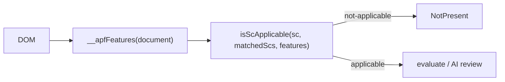

Features are merged across pages (`mergeFeatures`) and drive **success-criterion
applicability**: an SC that isn't applicable (e.g. captions when there is no video)
is marked `NotPresent`, not `Failed`. The page language is also detected
(`detectPageLanguage`) and persisted for the report.

### 5.5 Interaction scan

Two checks run outside the pure rule engine because they need real browser behaviour:

- **Reflow (1.4.10)** — the viewport is resized to 320px; horizontal overflow
  (`scrollWidth > innerWidth + 1`) is flagged.
- **Keyboard trap (2.1.2)** — Tab is pressed up to 20 times, tracking the *distinct*
  elements focus lands on; a page with many focusable elements but only one distinct
  target is flagged as a trap.

### 5.6 Evidence capture

For each page the scanner captures a full-page screenshot (with violations
highlighted) and element screenshots for the top findings; images are optimized
(`optimizeEvidenceImage`) and stored as bytes in `evidence`, with page snapshots
(screenshot + HTML) referenced from the assessment.

### 5.7 Findings consolidation

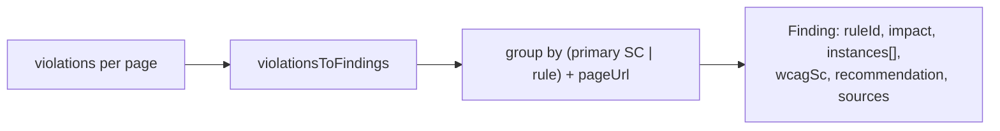

Each engine violation becomes a `Finding` with its node instances; findings are
grouped by primary success criterion (or rule) + page. Impact is the rule's severity
(`critical` / `serious` / `moderate` / `minor`); a recommendation is attached
(`getRecommendation`); provenance is `sources: [{ tool: "engine" }]`.

### 5.8 AI review (unresolved SCs)

SCs the deterministic engine left `Unresolved` go through AI review:

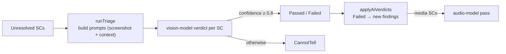

`runTriage` builds per-SC prompts (screenshot + context), the BYOK vision model
returns a verdict with a confidence score, and only confident verdicts (≥ 0.8) fold
in; otherwise the SC stays `CannotTell`. A second **audio pass** resolves media SCs.
Budget is tracked per scan (calls + images).

### 5.9 Scoring & conformance (folding)

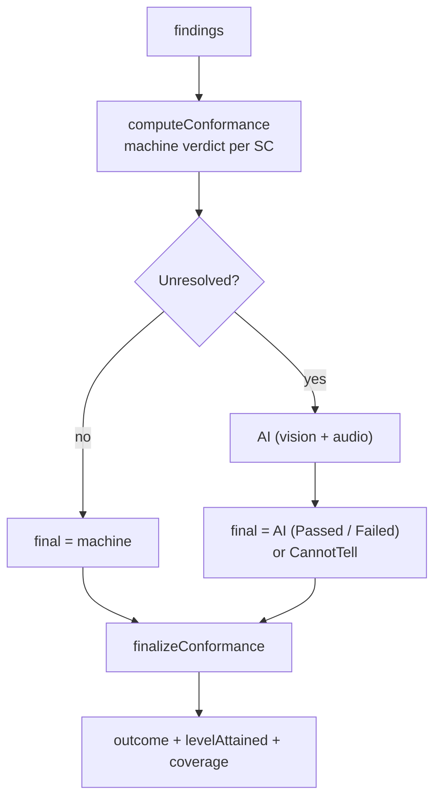

Machine verdicts (`Passed` / `Failed` / `NotPresent` / `Unresolved`) are computed
from findings' `wcagSc` tags, applicability, and the passed-rule set; AI verdicts
resolve `Unresolved` rows; `finalizeConformance` produces the final per-SC table, the
`levelAttained` (A/AA/AAA), the `coverage`, and the conformance `outcome`
(`conforms` / `does-not-conform` / `undetermined`).

### 5.10 Site audit (perf / SEO)

After the accessibility scan, a **site audit** queries Browserless `/performance` for
perf/SEO signals, appended to the report as a non-scored appendix.

---

## 6. Scan Pipeline

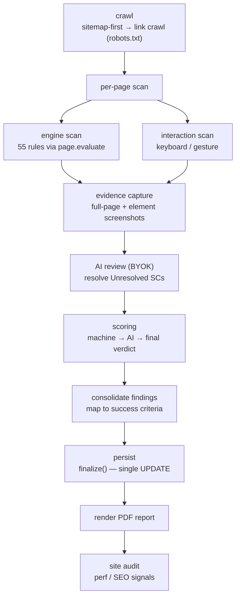

1. **Crawl** — sitemap-first, then link crawl, respecting `robots.txt`. Depth-0
   (single-page) scans skip the crawl entirely.
2. **Scan** — the engine (55 rules) + an interaction scan (keyboard traversal, focus
   order) per page.
3. **Evidence** — one full-page screenshot with violations highlighted + element
   screenshots for the top findings (stored as bytes in `evidence`).
4. **AI review** — BYOK models resolve SCs the deterministic engine left `Unresolved`.
5. **Scoring** — machine verdicts folded with AI verdicts into final per-SC verdicts
   and a conformance outcome.
6. **Consolidate** — findings mapped to WCAG success criteria.
7. **Persist** — one `finalize()` UPDATE (findings + comparison + pages + snapshots +
   score) rather than many writes.
8. **PDF** — render and store the report.
9. **Site audit** — a perf/SEO appendix (via Browserless `/performance`).

**Resilience:** each page is wrapped in `WORKER_PAGE_TIMEOUT_MS` (default 180s); a
pathological page is skipped and the browser recreated so one bad page never blocks
the queue.

---

## 7. Engine Architecture (clean-room)

The engine is **clean-room in-house** — there are no third-party accessibility engines
(axe-core, IBM, Lighthouse) anywhere in the scan path.

### Rule model

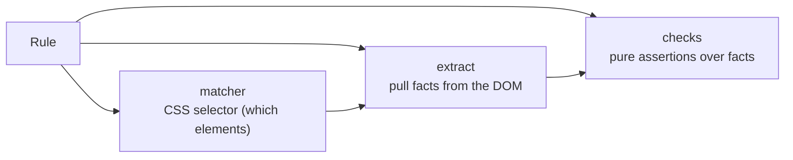

Every rule is a triple:

- **`matcher`** — a CSS selector that picks candidate elements.
- **`extract`** — a function that reads facts from a matched element (a pure snapshot
  of the DOM, never live).
- **`checks`** — atomic, pure assertions over the extracted facts → `pass` / `fail` /
  `incomplete`.

Because `extract` only uses browser globals and `checks` are pure, the whole engine can
be serialized and injected into the page.

### Injection + execution

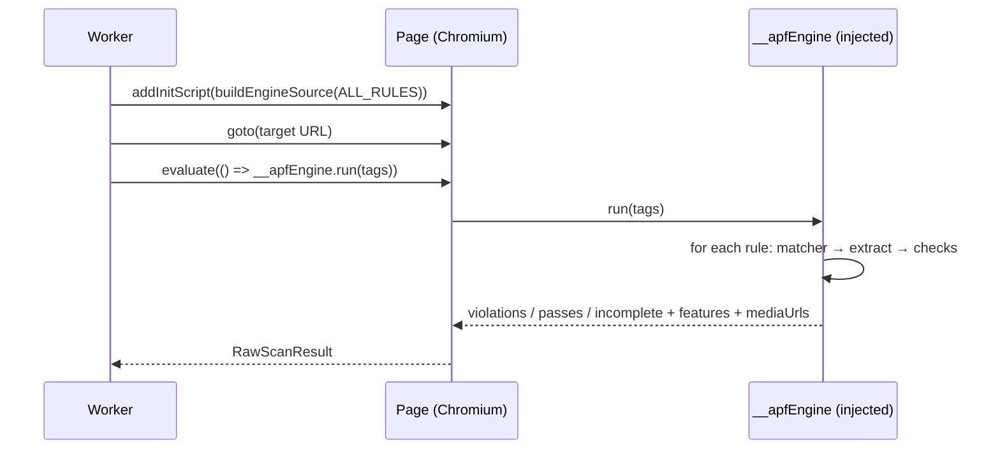

- `buildEngineSource` inlines each rule via `.toString()` into a self-contained script.
- The script is injected with **`page.addInitScript`** (runs at CDP level, so the
  target site's CSP cannot block it — `addScriptTag` would be).
- `page.evaluate` calls `__apfEngine.run(tags)` in-page and returns a raw result that
  is mapped to violations/passes/incomplete plus page features and media URLs.

### Rule inventory (55 rules)

| Category | Count | Notes |
|---|---|---|
| perceivable | 14 | colour/contrast, text alternatives, media |
| robust | 9 | parsing, name/role/value, status |
| additional | 9 | supplemental checks |
| gap-fill | 8 | fills SCs the base set doesn't cover |
| operable | 5 | keyboard, focus, navigation |
| rendering | 4 | layout / visibility |
| interaction | 3 | keyboard traversal, gestures |
| understandable | 3 | language, headings, labels |
| **Total** | **55** | |

Full rule documentation lives in `docs/engine/` (one entry per rule).

### Standards catalog

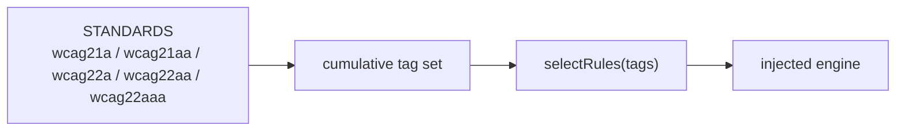

Rules are tagged by the WCAG version they were introduced in (non-cumulative). Selecting
a standard therefore composes the full cumulative tag set across versions; `wcag22aa`
(the default) carries the 2.0/2.1/2.2 AA additions.

---

## 8. Scoring & Conformance Model

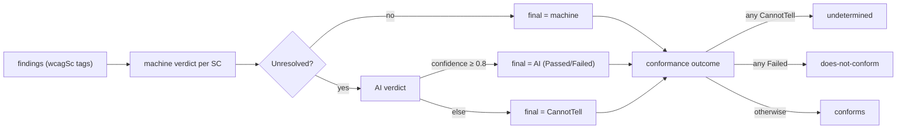

- **Machine verdict** per SC: `Passed` · `Failed` · `NotPresent` · `Unresolved`.
- **AI verdict** folds in only `Unresolved` SCs (confidence threshold 0.8).
- **Final verdict** (W3C/WAI vocabulary): `Passed` · `Failed` · `CannotTell` · `NotPresent`.
- **Conformance outcome**: `undetermined` (any `CannotTell`) → `does-not-conform`
  (any `Failed`) → `conforms`.
- **Level attained**: `A` / `AA` / `AAA` (highest level with no `Failed`/`CannotTell`).
- **Coverage**: `tested / total` (tested = passed + failed).
- **Finding impact** (severity): `critical` · `serious` · `moderate` · `minor`.

> The severity-weighted 0–100 score was replaced by this conformance model
> (outcome + coverage + level attained + per-SC table).

---

## 9. AI Review & Human Review

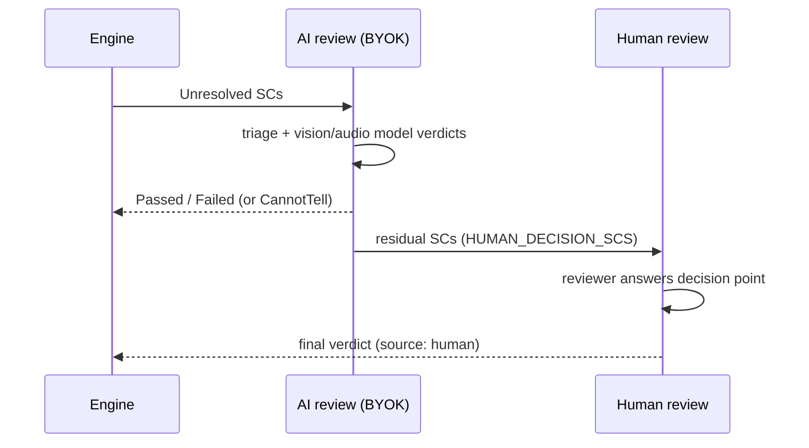

- **AI review** is **BYOK** (bring-your-own-key): Anthropic / OpenAI / Gemini, with
  vision + audio models, a per-scan budget/balance, and a confidence threshold of 0.8.
- **Human review** is the residual set the AI *cannot* decide — captured by a
  six-category decision-point contract in `human-decision.ts`:

| Category | `whyNotAi` (why a machine can't decide — yet) |
|---|---|
| interaction | synthetic events can't reproduce real keyboard/gesture/AT input |
| temporal | a static snapshot can't sit through a session or measure flash frequency |
| dynamic-state | transient UI state the snapshot can't observe |
| multipage | cross-page consistency (nav, labels) |
| editorial | wording, semantics, meaning |
| domain | subject-matter judgement |

Each category carries a `pathToAi` (the future enhancement that moves it into AI
review). `HUMAN_DECISION_SCS` is a *snapshot expected to shrink over time* — the
"no permanently human" principle. Findings carry `source` provenance (`ai` / `human`).

---

## 10. Data Model (SurrealDB)

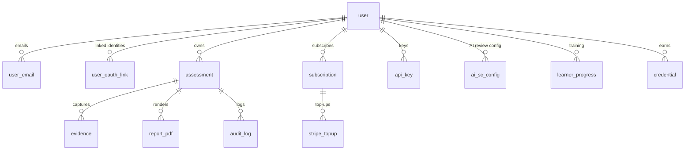

| Table | Purpose |
|---|---|
| `assessment` | the job record — `status` is the queue |
| `evidence` | screenshots + element snapshots (bytes) |
| `report_pdf` | rendered PDF bytes |
| `metrics` | storage/queue/failure counters |
| `user` | account identity |
| `user_email` | email compartment (canonical key) |
| `user_oauth_link` | `(provider, subject)` → user |
| `subscription` / `stripe_topup` | Stripe state |
| `api_key` | API credentials |
| `audit_log` | API-key audit trail |
| `rate_limit` | per-IP/route rate limiting |
| `ai_sc_config` | per-SC AI review configuration |
| `learner_progress` / `credential` | training |

**SurrealDB gotchas** (encode in any code touching this layer):

- Record-ID lookups need a cast: `WHERE id = type::record($id)`.
- `ORDER BY x` requires `x` in the projection.
- `SCHEMAFULL` can't bind arrays of objects — `findings`, `log`, `comparison` are
  stored as JSON strings (`JSON.stringify` / `JSON.parse`).
- `SCHEMAFULL` re-validates the whole record on any UPDATE — change a type via
  `DEFINE FIELD OVERWRITE` (a migration), not a plain write.

---

## 11. Auth & Identity

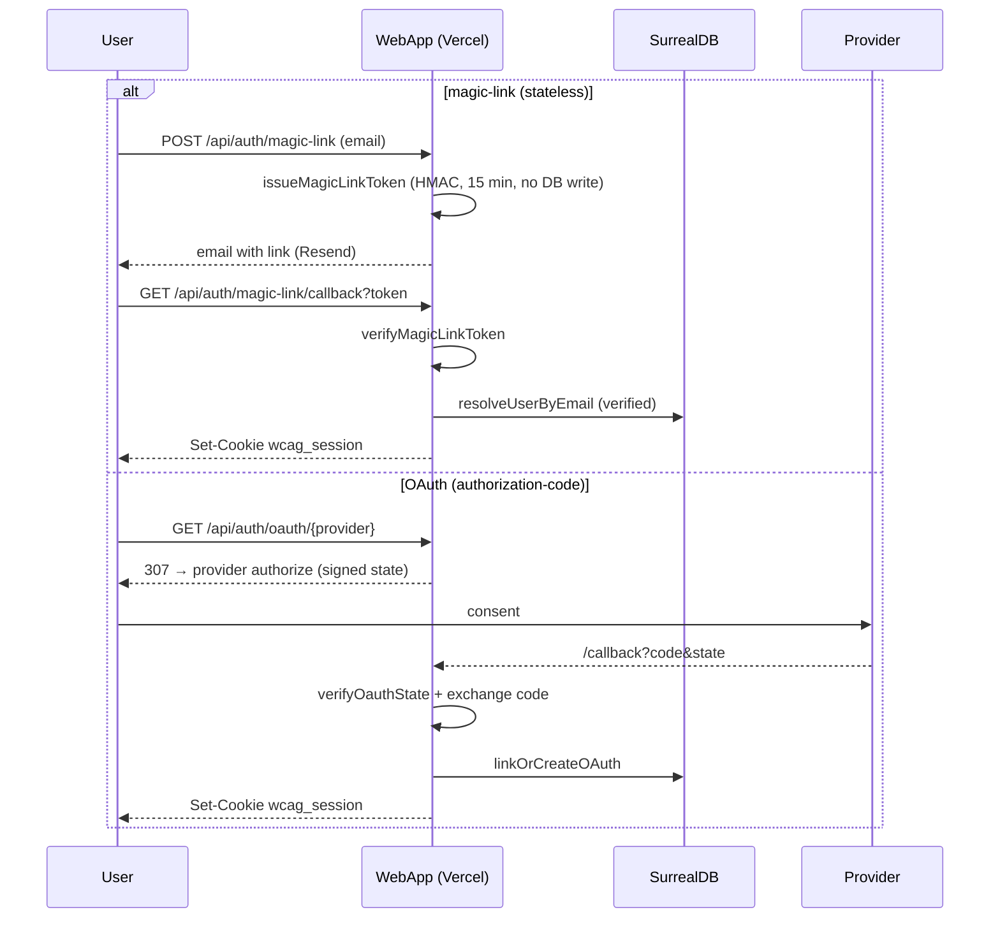

- **Magic link** — stateless: an HMAC-signed token (15-min TTL), no DB write until the
  email is verified by clicking the link.
- **OAuth** — authorization-code flow for Google / GitHub / Microsoft (no client-side
  tokens; Google JWKS is verified locally).
- **Session** — an HMAC-JWT (`wcag_session`, httpOnly, 24h).
- **One email → one account** — `normalizeEmail` (trim + lowercase) is the canonical
  compartment key; `linkOrCreateOAuth` resolves `(provider, subject) → email → account`,
  and `EmailConflictError` guards against unverified-email hijacking.

Auth is SurrealDB-native (not Clerk). Every assessment needs a non-null `ownerId`.

---

## 12. API Surface

| Group | Routes | Notes |
|---|---|---|
| Assessments | `/api/v1/assessments` (+ `/{id}`, `/export`, `/vpat`, `/badge.svg`, `/stream`, `/evidence/{evidenceId}`, `/review`) | Zod-validated; `POST` inserts `queued` → `202` |
| Review | `/api/v1/review/queue`, `/{id}`, `/{id}/claim`, `/{id}/submit`, `/bulk-resolve` | human-review queue |
| Findings | `/api/v1/findings`, `/suggest-fix` | AI remediation suggestions |
| Account | `/api/account`, `/ai-key`, `/ai-provision`, `/ai-topup`, `/models`, `/api/v1/account/usage` | BYOK + usage |
| API keys | `/api/v1/api-keys`, `/{id}` | key lifecycle |
| Training | `/api/v1/training/lessons`, `/quizzes`, `/progress`, `/credential` | free path |
| Auth | `/api/auth/magic-link`, `/oauth/{provider}`, `/session`, `/sign-out` | stateless + OAuth |
| Webhooks | `/api/webhooks/stripe` | Stripe events |
| Health | `/api/v1/health` | liveness |

Cross-cutting: Zod validation everywhere, SSRF guard on the submitted URL, and
rate limiting.

---

## 13. Internationalization

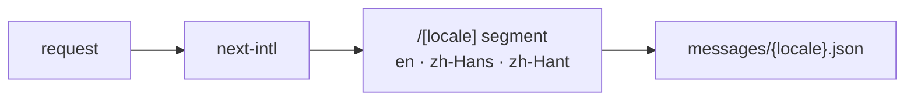

`next-intl` with `[locale]` route segments and three locales (`en`, `zh-Hans`,
`zh-Hant`). Navigation is centralized in `src/lib/site/navigation.ts`.

---

## 14. Payments

Stripe handles **subscriptions** and **one-off donations**; the webhook
(`/api/webhooks/stripe`) syncs `subscription` / `stripe_topup` records. BYOK AI
consumption is metered against a per-user balance with top-ups.

---

## 15. Training (free path)

A self-contained training path — lessons, paths, quizzes — tracking progress in
`learner_progress` and issuing `credential` records (downloadable certificate).
Lesson checks are graded server-side (`/api/v1/training/lessons/[id]/check`).

---

## 16. Observability & Security

**Observability:** pino-structured JSON logging (`src/lib/observability/logger`) +
lightweight metrics (`src/lib/observability/metrics`) persisted to the `metrics`
table. Sentry was removed (FSL dependency).

**Security:**

- SSRF guard on the submitted URL before any outbound fetch.
- Rate limiting (`rate_limit` table).
- BYOK API keys encrypted at rest.
- Secrets: repo-level push protection + secret scanning enabled.
- No secrets committed; `.env*`, hostnames, and instance IDs are gitignored.

---

## 17. Deployment & Operations

```mermaid
flowchart LR
  PUSH["push to main"] --> CI["GitHub Actions CI<br/>check / lint / test / build"]
  PUSH --> V["Vercel auto-deploy"]
  WORKER["worker deploy"] --> DEP["deploy/swas/deploy.sh<br/>git pull → install → worker:build → systemctl restart"]
  MIG["schema change"] --> RUN["run-once migration<br/>tsx src/db/migrate-*.ts"]
```

- **Vercel** auto-deploys on push to `main`.
- **Worker** — `deploy/swas/deploy.sh` on the SWAS box: `git pull`, `pnpm install
  --frozen-lockfile`, `pnpm worker:build` (esbuild → `dist/worker.js`), `systemctl
  restart wcag-score-worker`.
- **Migrations** — standalone, idempotent, run-once scripts (run from the worker box);
  `pnpm db:migrate` is avoided in prod (fails on "already exists").
- **CI** — GitHub Actions runs `pnpm check`, `lint`, `test`, `build` on push/PR.
- **Worker build** must use `--packages=external`; production runs `node dist/worker.js`
  (not `tsx`, which hangs in Docker).

---

## 18. Architectural Decisions

| ADR | Decision |
|---|---|
| `docs/architecture/adr/001-db-as-queue.md` | SurrealDB `assessment.status` is the queue; no background work on Vercel |
| `docs/architecture/adr/002-axe-addinitscript.md` | engine injected via `addInitScript` (CDP-level, CSP-immune) |
| `docs/architecture/adr/003-tool-consolidation.md` | replace third-party scanners with the clean-room engine |

---

## 19. Evolution & Scaling Roadmap (2-year horizon)

Forward-looking, not yet built:

```mermaid
flowchart LR
  NOW["today"] --> A["engine coverage ↑<br/>55 → more SCs automated"]
  NOW --> B["human-decision set ↓<br/>AI review automation"]
  NOW --> C["worker horizontal scale<br/>sharded queue / multiple workers"]
  NOW --> D["multi-region<br/>worker + DB close to targets"]
  A & B & C & D --> E["more SCs fully machine/AT-resolved,<br/>less human review, higher throughput"]
```

| Axis | Today | 2-year direction |
|---|---|---|
| Engine coverage | 55 rules | grow rule set toward full WCAG 2.2 automated coverage |
| Human review | 6 residual categories | shrink `HUMAN_DECISION_SCS` via the `pathToAi` enhancements (real keyboard/AT automation, session simulation, flash analysis) |
| Worker scaling | single SWAS box, pooled browsers | horizontal workers with a sharded queue + queue-depth autoscaling |
| Deployment regions | one SWAS region | co-locate worker/DB near target regions to cut crawl latency |
| Storage | 180-day retention + evidence compaction | tiered storage, tighter retention/compaction policy |

---

## 20. Rule → SC coverage matrix

Reference: every engine rule mapped to its success criterion, plus the reverse
index. The **55 rules** cover **38 success criteria** directly; the worker-side
interaction scan adds **2 more** (1.4.10 Reflow, 2.1.2 No Keyboard Trap), for
**40 machine-checkable SCs** out of the **87** in the catalog. Every other SC is
resolved by AI or human review.

**Applicability classes**

| Class | Meaning |
|---|---|
| Machine (partial) | has a rule, but the matcher isn't a complete enumeration of the content type → no match ⇒ **Cannot tell** (never a false "not present") |
| Matcher-exhaustive | the matcher enumerates the content type → no match ⇒ **NotPresent** |
| Always applicable | non-interference SC (WCAG 2.2 §5.2.5) — never **NotPresent** |
| Feature-flag | applicability routed through page-feature flags (`checkScApplicability`) |
| Interaction scan | checked by the worker-side scan (reflow / keyboard trap), not the in-page engine |
| Not machine-checked | no rule → feature-flag applicability; resolved by AI / human review |

### 20.1 Rule → SC


| # | Rule | Category | Impact | SC | Matcher | Applicability |
|---|---|---|---|---|---|---|
| 1 | `image-alt` | perceivable | critical | 1.1.1 Non-text Content | `img` | Machine (partial) |
| 2 | `input-image-alt` | perceivable | serious | 1.1.1 Non-text Content | `input[type='image']` | Machine (partial) |
| 3 | `object-alt` | perceivable | serious | 1.1.1 Non-text Content | `object` | Machine (partial) |
| 4 | `svg-img-alt` | perceivable | serious | 1.1.1 Non-text Content | `svg` | Machine (partial) |
| 5 | `video-caption` | perceivable | serious | 1.2.2 Captions (Prerecorded) | `video` | Matcher-exhaustive (no match → NotPresent) |
| 6 | `list` | perceivable | moderate | 1.3.1 Info and Relationships | `ul, ol` | Machine (partial) |
| 7 | `listitem` | perceivable | moderate | 1.3.1 Info and Relationships | `li` | Machine (partial) |
| 8 | `dlitem` | perceivable | moderate | 1.3.1 Info and Relationships | `dt, dd` | Machine (partial) |
| 9 | `definition-list` | perceivable | moderate | 1.3.1 Info and Relationships | `dl` | Machine (partial) |
| 10 | `region` | perceivable | moderate | 1.3.1 Info and Relationships | `document` | Machine (partial) |
| 11 | `landmark-unique` | perceivable | moderate | 1.3.1 Info and Relationships | `document` | Machine (partial) |
| 12 | `heading-order` | perceivable | moderate | 1.3.1 Info and Relationships | `document` | Machine (partial) |
| 13 | `empty-heading` | perceivable | minor | 2.4.6 Headings and Labels | `h1, h2, h3, h4, h5, h6` | Machine (partial) |
| 14 | `meta-viewport` | perceivable | serious | 1.4.4 Resize Text | `meta[name='viewport']` | Machine (partial) |
| 15 | `document-title` | operable | serious | 2.4.2 Page Titled | `document` | Machine (partial) |
| 16 | `link-name` | operable | serious | 2.4.4 Link Purpose (In Context) | `a[href]` | Matcher-exhaustive (no match → NotPresent) |
| 17 | `skip-link` | operable | moderate | 2.4.1 Bypass Blocks | `document` | Machine (partial) |
| 18 | `tabindex` | operable | serious | 2.4.3 Focus Order | `[tabindex]` | Machine (partial) |
| 19 | `focus-visible` | operable | moderate | 2.4.7 Focus Visible | `document` | Machine (partial) |
| 20 | `html-has-lang` | understandable | serious | 3.1.1 Language of Page | `html` | Machine (partial) |
| 21 | `html-lang-valid` | understandable | serious | 3.1.1 Language of Page | `html` | Machine (partial) |
| 22 | `label` | understandable | critical | 3.3.2 Labels or Instructions | `input:not([type='hidden']):not([type='submit']):…` | Matcher-exhaustive (no match → NotPresent) |
| 23 | `button-name` | robust | critical | 4.1.2 Name, Role, Value | `button` | Machine (partial) |
| 24 | `input-button-name` | robust | serious | 4.1.2 Name, Role, Value | `input[type='button'], input[type='submit'], inpu…` | Machine (partial) |
| 25 | `select-name` | robust | serious | 4.1.2 Name, Role, Value | `select` | Machine (partial) |
| 26 | `frame-title` | robust | serious | 4.1.2 Name, Role, Value | `iframe, frame` | Machine (partial) |
| 27 | `aria-roles` | robust | serious | 4.1.2 Name, Role, Value | `[role]` | Machine (partial) |
| 28 | `aria-valid-attr-value` | robust | serious | 4.1.2 Name, Role, Value | `[aria-checked], [aria-pressed], [aria-expanded],…` | Machine (partial) |
| 29 | `aria-required-attr` | robust | serious | 4.1.2 Name, Role, Value | `[role]` | Machine (partial) |
| 30 | `aria-hidden-focus` | robust | serious | 4.1.2 Name, Role, Value | `[aria-hidden='true']` | Machine (partial) |
| 31 | `duplicate-id` | robust | moderate | 4.1.1 Parsing | `document` | Machine (partial) |
| 32 | `color-contrast` | rendering | serious | 1.4.3 Contrast (Minimum) | `p, h1, h2, h3, h4, h5, h6, li, a, button, label,…` | Machine (partial) |
| 33 | `target-size` | rendering | serious | 2.5.8 Target Size (Minimum) | `button, [role='button'], a[href], input:not([typ…` | Machine (partial) |
| 34 | `meta-refresh` | rendering | serious | 2.2.1 Timing Adjustable | `meta[http-equiv='refresh' i]` | Machine (partial) |
| 35 | `non-text-contrast` | rendering | serious | 1.4.11 Non-text Contrast | `input:not([type='hidden']), select, textarea, bu…` | Machine (partial) |
| 36 | `click-events-have-key-events` | interaction | serious | 2.1.1 Keyboard | `[onclick], [role='button'], [role='link'], [role…` | Machine (partial) |
| 37 | `pointer-cancellation` | interaction | serious | 2.5.2 Pointer Cancellation | `[onmousedown], [onpointerdown], [ontouchstart]` | Machine (partial) |
| 38 | `dragging-movements` | interaction | serious | 2.5.7 Dragging Movements | `[draggable='true']` | Machine (partial) |
| 39 | `no-autoplay-audio` | additional | serious | 1.4.2 Audio Control | `audio[autoplay], video[autoplay]` | Always applicable |
| 40 | `orientation` | additional | serious | 1.3.4 Orientation | `document` | Machine (partial) |
| 41 | `autocomplete-valid` | additional | serious | 1.3.5 Identify Input Purpose | `input[autocomplete]` | Feature-flag |
| 42 | `text-spacing` | additional | serious | 1.4.12 Text Spacing | `document` | Machine (partial) |
| 43 | `lang-of-parts` | additional | serious | 3.1.2 Language of Parts | `[lang]` | Machine (partial) |
| 44 | `pause-stop-hide` | additional | serious | 2.2.2 Pause, Stop, Hide | `marquee, blink` | Always applicable |
| 45 | `media-transcript` | additional | serious | 1.2.1 Audio-only and Video-only (Prerecorded) | `audio, video` | Matcher-exhaustive (no match → NotPresent) |
| 46 | `label-in-name` | additional | serious | 2.5.3 Label in Name | `button, a[href], input:not([type='hidden']), sel…` | Machine (partial) |
| 47 | `use-of-color` | additional | serious | 1.4.1 Use of Color | `document` | Machine (partial) |
| 48 | `contrast-enhanced` | gap-fill | serious | 1.4.6 Contrast (Enhanced) | `p, h1, h2, h3, h4, h5, h6, li, a, button, label,…` | Machine (partial) |
| 49 | `target-size-enhanced` | gap-fill | serious | 2.5.5 Target Size (Enhanced) | `button, [role='button'], a[href], input:not([typ…` | Machine (partial) |
| 50 | `multiple-ways` | gap-fill | moderate | 2.4.5 Multiple Ways | `document` | Machine (partial) |
| 51 | `location` | gap-fill | moderate | 2.4.8 Location | `document` | Machine (partial) |
| 52 | `section-headings` | gap-fill | moderate | 2.4.10 Section Headings | `document` | Machine (partial) |
| 53 | `help` | gap-fill | moderate | 3.3.5 Help | `document` | Machine (partial) |
| 54 | `redundant-entry` | gap-fill | moderate | 3.3.7 Redundant Entry | `form` | Matcher-exhaustive (no match → NotPresent) |
| 55 | `no-timing` | gap-fill | moderate | 2.2.3 No Timing | `document` | Machine (partial) |

### 20.2 SC → rules

| SC | Level | Title | Rules | Applicability |
|---|---|---|---|---|
| ✓ 1.1.1 | A | Non-text Content | `image-alt`, `input-image-alt`, `object-alt`, `svg-img-alt` | Machine (partial) — no match ⇒ Cannot tell |
| ✓ 1.2.1 | A | Audio-only and Video-only (Prerecorded) | `media-transcript` | Matcher-exhaustive — no match ⇒ NotPresent |
| ✓ 1.2.2 | A | Captions (Prerecorded) | `video-caption` | Matcher-exhaustive — no match ⇒ NotPresent |
|   1.2.3 | A | Audio Description or Media Alternative (Prerecorded) | — | Not machine-checked — feature-flag applicability |
|   1.2.4 | AA | Captions (Live) | — | Not machine-checked — feature-flag applicability |
|   1.2.5 | AA | Audio Description (Prerecorded) | — | Not machine-checked — feature-flag applicability |
|   1.2.6 | AAA | Sign Language (Prerecorded) | — | Not machine-checked — feature-flag applicability |
|   1.2.7 | AAA | Extended Audio Description (Prerecorded) | — | Not machine-checked — feature-flag applicability |
|   1.2.8 | AAA | Media Alternative (Prerecorded) | — | Not machine-checked — feature-flag applicability |
|   1.2.9 | AAA | Audio-only (Live) | — | Not machine-checked — feature-flag applicability |
| ✓ 1.3.1 | A | Info and Relationships | `list`, `listitem`, `dlitem`, `definition-list`, `region`, `landmark-unique`, `heading-order` | Machine (partial) — no match ⇒ Cannot tell |
|   1.3.2 | A | Meaningful Sequence | — | Not machine-checked — feature-flag applicability |
|   1.3.3 | A | Sensory Characteristics | — | Not machine-checked — feature-flag applicability |
| ✓ 1.3.4 | AA | Orientation | `orientation` | Machine (partial) — no match ⇒ Cannot tell |
| ✓ 1.3.5 | AA | Identify Input Purpose | `autocomplete-valid` | Feature-flag routed |
|   1.3.6 | AAA | Identify Purpose | — | Not machine-checked — feature-flag applicability |
| ✓ 1.4.1 | A | Use of Color | `use-of-color` | Machine (partial) — no match ⇒ Cannot tell |
| ✓ 1.4.2 | A | Audio Control | `no-autoplay-audio` | Always applicable (non-interference) — never NotPresent |
| ✓ 1.4.3 | AA | Contrast (Minimum) | `color-contrast` | Machine (partial) — no match ⇒ Cannot tell |
| ✓ 1.4.4 | AA | Resize Text | `meta-viewport` | Machine (partial) — no match ⇒ Cannot tell |
|   1.4.5 | AA | Images of Text | — | Not machine-checked — feature-flag applicability |
| ✓ 1.4.6 | AAA | Contrast (Enhanced) | `contrast-enhanced` | Machine (partial) — no match ⇒ Cannot tell |
|   1.4.7 | AAA | Low or No Background Audio | — | Not machine-checked — feature-flag applicability |
|   1.4.8 | AAA | Visual Presentation | — | Not machine-checked — feature-flag applicability |
|   1.4.9 | AAA | Images of Text (No Exception) | — | Not machine-checked — feature-flag applicability |
| ✓ 1.4.10 | AA | Reflow | — · *reflow check* | Interaction scan (worker) |
| ✓ 1.4.11 | AA | Non-text Contrast | `non-text-contrast` | Machine (partial) — no match ⇒ Cannot tell |
| ✓ 1.4.12 | AA | Text Spacing | `text-spacing` | Machine (partial) — no match ⇒ Cannot tell |
|   1.4.13 | AA | Content on Hover or Focus | — | Not machine-checked — feature-flag applicability |
| ✓ 2.1.1 | A | Keyboard | `click-events-have-key-events` | Machine (partial) — no match ⇒ Cannot tell |
| ✓ 2.1.2 | A | No Keyboard Trap | — · *keyboard-trap check* | Always applicable (non-interference) — never NotPresent |
|   2.1.3 | AAA | Keyboard (No Exception) | — | Not machine-checked — feature-flag applicability |
|   2.1.4 | A | Character Key Shortcuts | — | Not machine-checked — feature-flag applicability |
| ✓ 2.2.1 | A | Timing Adjustable | `meta-refresh` | Machine (partial) — no match ⇒ Cannot tell |
| ✓ 2.2.2 | A | Pause, Stop, Hide | `pause-stop-hide` | Always applicable (non-interference) — never NotPresent |
| ✓ 2.2.3 | AAA | No Timing | `no-timing` | Machine (partial) — no match ⇒ Cannot tell |
|   2.2.4 | AAA | Interruptions | — | Not machine-checked — feature-flag applicability |
|   2.2.5 | AAA | Re-authenticating | — | Not machine-checked — feature-flag applicability |
|   2.2.6 | AAA | Timeouts | — | Not machine-checked — feature-flag applicability |
|   2.3.1 | A | Three Flashes or Below Threshold | — | Always applicable (non-interference) — never NotPresent |
|   2.3.2 | AAA | Three Flashes | — | Not machine-checked — feature-flag applicability |
|   2.3.3 | AAA | Animation from Interactions | — | Not machine-checked — feature-flag applicability |
| ✓ 2.4.1 | A | Bypass Blocks | `skip-link` | Machine (partial) — no match ⇒ Cannot tell |
| ✓ 2.4.2 | A | Page Titled | `document-title` | Machine (partial) — no match ⇒ Cannot tell |
| ✓ 2.4.3 | A | Focus Order | `tabindex` | Machine (partial) — no match ⇒ Cannot tell |
| ✓ 2.4.4 | A | Link Purpose (In Context) | `link-name` | Matcher-exhaustive — no match ⇒ NotPresent |
| ✓ 2.4.5 | AA | Multiple Ways | `multiple-ways` | Machine (partial) — no match ⇒ Cannot tell |
| ✓ 2.4.6 | AA | Headings and Labels | `empty-heading` | Machine (partial) — no match ⇒ Cannot tell |
| ✓ 2.4.7 | AA | Focus Visible | `focus-visible` | Machine (partial) — no match ⇒ Cannot tell |
| ✓ 2.4.8 | AAA | Location | `location` | Machine (partial) — no match ⇒ Cannot tell |
|   2.4.9 | AAA | Link Purpose (Link Only) | — | Not machine-checked — feature-flag applicability |
| ✓ 2.4.10 | AAA | Section Headings | `section-headings` | Machine (partial) — no match ⇒ Cannot tell |
|   2.4.11 | AA | Focus Not Obscured (Minimum) | — | Not machine-checked — feature-flag applicability |
|   2.4.12 | AAA | Focus Not Obscured (Enhanced) | — | Not machine-checked — feature-flag applicability |
|   2.4.13 | AAA | Focus Appearance | — | Not machine-checked — feature-flag applicability |
|   2.5.1 | A | Pointer Gestures | — | Not machine-checked — feature-flag applicability |
| ✓ 2.5.2 | A | Pointer Cancellation | `pointer-cancellation` | Machine (partial) — no match ⇒ Cannot tell |
| ✓ 2.5.3 | A | Label in Name | `label-in-name` | Machine (partial) — no match ⇒ Cannot tell |
|   2.5.4 | A | Motion Actuation | — | Not machine-checked — feature-flag applicability |
| ✓ 2.5.5 | AAA | Target Size (Enhanced) | `target-size-enhanced` | Machine (partial) — no match ⇒ Cannot tell |
|   2.5.6 | AAA | Concurrent Input Mechanisms | — | Not machine-checked — feature-flag applicability |
| ✓ 2.5.7 | AA | Dragging Movements | `dragging-movements` | Machine (partial) — no match ⇒ Cannot tell |
| ✓ 2.5.8 | AA | Target Size (Minimum) | `target-size` | Machine (partial) — no match ⇒ Cannot tell |
| ✓ 3.1.1 | A | Language of Page | `html-has-lang`, `html-lang-valid` | Machine (partial) — no match ⇒ Cannot tell |
| ✓ 3.1.2 | AA | Language of Parts | `lang-of-parts` | Machine (partial) — no match ⇒ Cannot tell |
|   3.1.3 | AAA | Unusual Words | — | Not machine-checked — feature-flag applicability |
|   3.1.4 | AAA | Abbreviations | — | Not machine-checked — feature-flag applicability |
|   3.1.5 | AAA | Reading Level | — | Not machine-checked — feature-flag applicability |
|   3.1.6 | AAA | Pronunciation | — | Not machine-checked — feature-flag applicability |
|   3.2.1 | A | On Focus | — | Not machine-checked — feature-flag applicability |
|   3.2.2 | A | On Input | — | Not machine-checked — feature-flag applicability |
|   3.2.3 | AA | Consistent Navigation | — | Not machine-checked — feature-flag applicability |
|   3.2.4 | AA | Consistent Identification | — | Not machine-checked — feature-flag applicability |
|   3.2.5 | AAA | Change on Request | — | Not machine-checked — feature-flag applicability |
|   3.2.6 | A | Consistent Help | — | Not machine-checked — feature-flag applicability |
|   3.3.1 | A | Error Identification | — | Not machine-checked — feature-flag applicability |
| ✓ 3.3.2 | A | Labels or Instructions | `label` | Matcher-exhaustive — no match ⇒ NotPresent |
|   3.3.3 | AA | Error Suggestion | — | Not machine-checked — feature-flag applicability |
|   3.3.4 | AA | Error Prevention (Legal, Financial, Data) | — | Not machine-checked — feature-flag applicability |
| ✓ 3.3.5 | AAA | Help | `help` | Machine (partial) — no match ⇒ Cannot tell |
|   3.3.6 | AAA | Error Prevention (All) | — | Not machine-checked — feature-flag applicability |
| ✓ 3.3.7 | A | Redundant Entry | `redundant-entry` | Matcher-exhaustive — no match ⇒ NotPresent |
|   3.3.8 | AA | Accessible Authentication (Minimum) | — | Not machine-checked — feature-flag applicability |
|   3.3.9 | AAA | Accessible Authentication (Enhanced) | — | Not machine-checked — feature-flag applicability |
| ✓ 4.1.1 | A | Parsing | `duplicate-id` | Machine (partial) — no match ⇒ Cannot tell |
| ✓ 4.1.2 | A | Name, Role, Value | `button-name`, `input-button-name`, `select-name`, `frame-title`, `aria-roles`, `aria-valid-attr-value`, `aria-required-attr`, `aria-hidden-focus` | Machine (partial) — no match ⇒ Cannot tell |
|   4.1.3 | AA | Status Messages | — | Not machine-checked — feature-flag applicability |

---

## Key module map

| Module | Responsibility |
|---|---|
| `src/lib/assessment` | orchestration (crawl → scan → consolidate → score → persist), DI-friendly |
| `src/lib/crawler` | sitemap + link crawl (`robots.txt`) |
| `src/lib/engine` | clean-room engine: rule registry, runner, interaction scan |
| `src/lib/evidence` | screenshot capture + `evidence` store |
| `src/lib/ai-review` | BYOK AI: providers, triage, budget, prompts |
| `src/lib/comparison` | findings consolidation + site audit (perf/SEO) |
| `src/lib/scoring` | machine → AI → final verdicts + conformance |
| `src/lib/standards` | WCAG SC catalog, applicability, remediation, human-decision contract |
| `src/lib/auth` | magic-link, OAuth, session, identity resolution |
| `src/lib/export` | PDF (report-document.tsx) + ACR + badge |
| `src/db` / `src/db/repository` | schema + repositories (assessment, evidence, api_key, …) |
| `src/server` | server-only adapters: scanner-factory, byok, stripe, rate-limit, ssrf |
| `src/worker` | the worker entrypoint (esbuild → `dist/worker.js`) |
