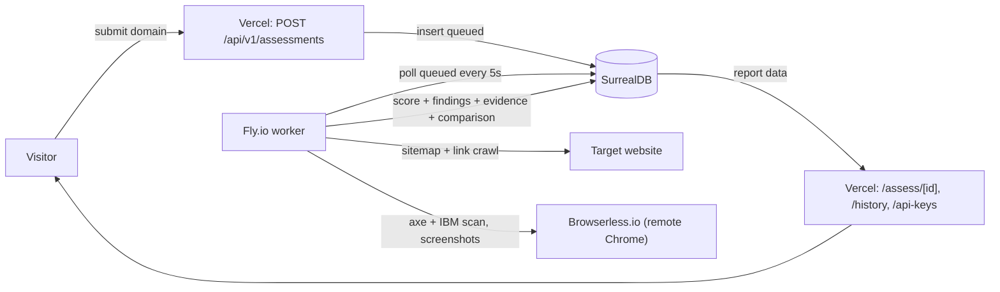

# Ascent Accessibility — Architecture

Web accessibility assessment platform (branded **Ascent Accessibility**) by Ascent Partners
Foundation. A visitor submits a domain + standard (WCAG 2.2 AA default); the system crawls the
site, runs three accessibility engines in a remote browser, consolidates the results, and returns
a score, a per-success-criterion conformance table, and evidence-backed findings — exportable as
PDF/CSV, with a live scan log.

## Topology

This is a **split, DB-as-queue** deployment. There is **no background work on Vercel**.

## Components

| Component | Role | Runtime |
|---|---|---|
| **Vercel** (Next.js App Router) | marketing site + API + report/history/api-keys pages | serverless (no background work) |
| **SurrealDB** | job store (the `assessment.status` field *is* the queue) + findings/evidence/comparison | SurrealDB Cloud |
| **Fly.io worker** | `dist/worker.js` — polls `queued`, runs `runAssessment`, persists results | Node container |
| **Browserless.io** | remote headless Chromium for axe/IBM scans, screenshots, and PDF export | subscription service |

## Data flow

1. `POST /api/v1/assessments` validates (Zod) + SSRF-checks the URL, then inserts a `queued`
   `assessment` record and returns `202`.
2. The worker polls for `queued` records, marks them `running`, then:
   1. **Crawls** (sitemap-first, then link crawl, `robots.txt`-respecting).
   2. **Scans** each page with **axe-core** (injected via `page.addInitScript` to bypass CSP).
   3. Runs **IBM Equal Access** (`accessibility-checker`) per page.
   4. Captures **evidence**: one full-page screenshot with all violations highlighted + element
      screenshots for the top findings (stored as bytes in SurrealDB `evidence`).
   5. **Consolidates** axe + IBM findings (and derives a Lighthouse-comparable score from the axe
      rule set), mapping each finding to WCAG success criteria via axe `wcagNNN` tags.
   6. **Scores**: severity-weighted 0–100 + a per-SC conformance table.
3. Results are persisted; the report page reads findings + comparison + evidence from SurrealDB.

## Key modules

| Module | Responsibility |
|---|---|
| `src/lib/assessment` | orchestration (crawl → scan → consolidate → score → persist), DI-friendly |
| `src/lib/crawler` | sitemap + link crawl |
| `src/lib/scanner` | axe injection + result mapping (evidence nodes, help, tags) |
| `src/lib/evidence` | screenshot capture + SurrealDB `evidence` store |
| `src/lib/comparison` | axe/IBM consolidation + Lighthouse-comparable score |
| `src/lib/scoring` | severity-weighted score + per-SC conformance |
| `src/lib/standards` | WCAG 2.2 SC catalog + axe-tag mapping + Lighthouse audit weights |
| `src/db/repository` | SurrealDB repositories (assessment, api_key, evidence) |
| `src/server/*` | SSRF, rate-limit, API keys, validation, stripe, scanner-factory |

## Standards chain

Every finding carries `wcagSc` (e.g. `1.4.3`), `wcagLevel`, and `scTitle`, resolved from the axe
`wcagNNN` tag through `src/lib/standards/wcag-sc.ts` (authoritative WCAG 2.2 catalog). The
conformance table lists every applicable SC with a `pass` / `fail` / `not-tested` result.

See also: [data model](data-model.md), [deployment](deployment.md), [environment](env-reference.md),
and [ADR index](adr/).
