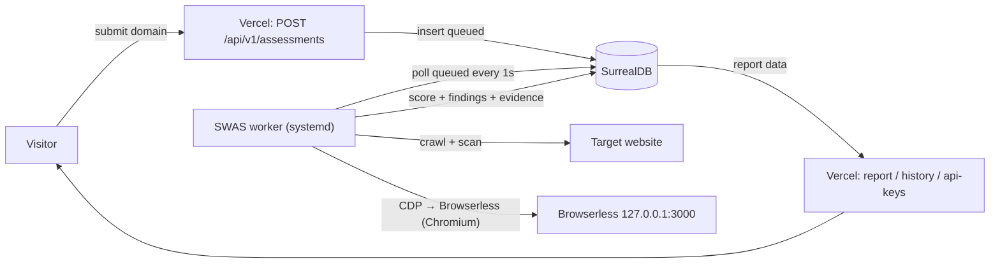

# Ascent Accessibility — Architecture Overview

> This is the concise entry point. The full, diagram-heavy reference is
> **[`architecture.md`](./architecture.md)**.

Web accessibility assessment platform (branded **Ascent Accessibility**) by Ascent
Partners Foundation. A visitor submits a domain + standard (WCAG 2.2 AA default); the
system crawls the site, runs an **in-house clean-room engine** in a headless browser,
and returns a conformance verdict, per-success-criterion results, and evidence-backed
findings — exportable as a **PDF-only** report, with magic-link + Google/GitHub/Microsoft
auth, Stripe subscriptions/donations, and a free training path.

## Topology

Split, **DB-as-queue** deployment — **no background work on Vercel**.

## Components

| Component | Role | Runtime |
|---|---|---|
| **Vercel** (Next.js App Router) | marketing site + API + report pages | serverless (no background work) |
| **SurrealDB** | job store (`assessment.status` *is* the queue) + data | SurrealDB Cloud |
| **Worker** | `dist/worker.js` — polls `queued`, runs `runAssessment`, persists results | SWAS box, systemd |
| **Browserless** | headless Chromium for engine scan, interaction scan, screenshots, PDF | Docker, co-located with the worker |

## Data flow

1. `POST /api/v1/assessments` validates (Zod) + SSRF-checks the URL, inserts a `queued`
   `assessment` record, returns `202`.
2. The worker polls for `queued` records, marks them `running`, then **crawls**
   (sitemap-first → link crawl, `robots.txt`), **scans** each page with the **clean-room
   engine** (55 rules, injected via `page.addInitScript`), captures **evidence**
   (screenshots), runs **BYOK AI review** on unresolved SCs, **scores** (machine → AI →
   final verdict → conformance), and **persists** via a single `finalize()`.
3. The report page reads findings + comparison + evidence from SurrealDB.

## Key modules

| Module | Responsibility |
|---|---|
| `src/lib/assessment` | orchestration (crawl → scan → consolidate → score → persist) |
| `src/lib/crawler` | sitemap + link crawl |
| `src/lib/engine` | clean-room engine: rule registry, runner, interaction scan |
| `src/lib/evidence` | screenshot capture + `evidence` store |
| `src/lib/ai-review` | BYOK AI review (providers, triage, budget) |
| `src/lib/comparison` | findings consolidation + site audit |
| `src/lib/scoring` | verdicts + conformance |
| `src/lib/standards` | WCAG SC catalog + human-decision contract |
| `src/lib/auth` | magic-link, OAuth, session, identity resolution |
| `src/db` | schema + repositories |
| `src/server` | scanner-factory, byok, stripe, rate-limit, ssrf |
| `src/worker` | worker entrypoint (`dist/worker.js`) |

## Detail pages

- **[`architecture.md`](./architecture.md)** — holistic reference (system context,
  containers, lifecycle, scan pipeline, engine, scoring, AI/human review, data model,
  auth, API, i18n, payments, training, observability, deployment, ADRs, roadmap).
- [`data-model.md`](./data-model.md) — SurrealDB schema detail.
- [`deployment.md`](./deployment.md) — deployment runbook.
- [`oauth-setup.md`](./oauth-setup.md) — OAuth provider configuration + env vars.
- [`env-reference.md`](./env-reference.md) — environment variable reference.
- [`adr/`](./adr/) — architectural decision records.
- [`assessment-methods.md`](./assessment-methods.md) — per-standard WCAG coverage + assessment methodology (compute / AI / human).
- [`../engine/`](../engine/) — the 55-rule engine documentation.
