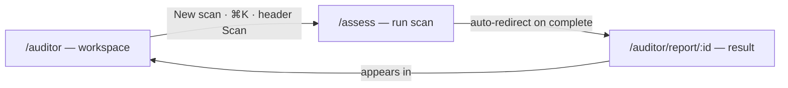

# 02 — Information Architecture (role-optimized 3-level sitemap)

Clean break (no redirects). Optimized for **fastest access per role**: every primary
action is ≤ 2 clicks from the role's landing page, nav is consolidated (primary vs
secondary), and everything is ≤ 3 levels deep.

Legend: 🔓 public · 🔒 signed-in · ★ shareable/public report.

## Optimized 3-level sitemap

```
L1  L2                            L3
────────────────────────────────────────────────────────────────────
Home
    /                                        🔓  hub (dual CTA)

Scan
    /assess                                 🔒  one form, scope toggle:
                                               single page | whole website
                                               (absorbs /site)

Training
    /training                               🔓  dashboard → Continue learning
    /training/paths                         🔓  catalog
    /training/paths/:id                     🔓  path overview
    /training/paths/:id/modules/:mid        🔓  module
    /training/lessons/:id                   🔒  lesson player
    /training/quizzes/:id                   🔒  quiz
    /training/certificate/:id (+.pdf)       🔓  certificate

Auditor
    /auditor                                🔒  workspace (quick scan, review)
    /auditor/review                         🔒  review queue
    /auditor/report/:id                     ★  report + PDF

Account
    /account                                🔒  profile + progress + credentials
    /api-keys                               🔒  API access (Account menu)

Company
    /about                                  🔓
    /pricing                                🔓
    /human-review                           🔓  paid review service
    /esg                                    🔓
    /validation                             🔓
    /roadmap                                🔓

Knowledge
    /standards                              🔓  WCAG index
    /standards/:sc                          🔓  SC detail
    /methodology                            🔓
    /remediation                            🔓
    /regulations                            🔓

Support
    /faq                                    🔓
    /resources                              🔓
    /contact                                🔓
    /donate                                 🔓

Auth
    /sign-in                                🔓
    /sign-up                                🔓

Legal
    /terms · /privacy · /sla · /refund · /accessibility-statement   🔓
```

## Role → fastest access (1–2 clicks from landing)

| Role | Landing | Primary action (1 click) | Secondary (2 clicks) |
|---|---|---|---|
| Visitor | `/` | `[Scan]` → sign-in → `/assess` · `[Start training]` → `/training` | `/training/paths` |
| Learner | `/training` | **Continue learning** → exact lesson | `/training/paths/:id` |
| Auditor | `/auditor` | `{New scan}` → `/assess` · open `/auditor/review` | `/auditor/report/:id` |
| Buyer | `/pricing` or `/human-review` | `{Contact}` | `/donate` |
| Reviewer | `/auditor/review` | claim / resolve | `/auditor/report/:id` |

Command palette (⌘K) is the escape hatch for everything else, so infrequent pages
stay out of the nav without losing speed.

## `/assess` ↔ `/auditor` relationship

Two halves of one loop, connected bidirectionally, kept as siblings:



| From | To | Trigger |
|---|---|---|
| `/auditor` | `/assess` | "New scan" quick action, ⌘K, header Scan CTA |
| `/assess` | `/auditor/report/:id` | auto-redirect on scan completion |
| `/auditor/report/:id` | `/auditor` | "Back to workspace" (signed-in) |
| `/assess` | `/auditor` | new assessment appears in recent activity + queue health + saved views |

Why siblings, not `/auditor/assess`: the scan is also the visitor's first action
(header "Scan" CTA) and a first-class nav item — `/auditor` is *management*, `/assess`
is *doing*. The loop is the connection, not the URL nesting.

## Navigation (consolidated)

**Header — primary:** Home · Training · Pricing · **Scan** (CTA) · *signed-in:* Auditor · Account (avatar).
**Footer — secondary:** About · Human review · ESG mapping · Validation · Standards ·
Methodology · Remediation · Regulations · Resources · FAQ · Roadmap · Contact · Donate.
**Footer — legal:** Terms · Privacy · SLA · Refunds · Accessibility.

Rationale: header drops from ~10 items to 4 (+2 signed-in), so the two pillars and
the scan are the visible, first-class actions; low-frequency content lives in the footer.

## Gating boundary (drives middleware + Layer-0 test)

| Boundary | Enforcement |
|---|---|
| `/assess`, `/account`, `/auditor` (workspace+review) | middleware `SESSION_COOKIE` |
| `/training` progress/quiz/credential submit | route handler (server-side) |
| `/training` catalog + lesson *view* (no progress) | public |
| `/auditor/report/:id` | public (shareable) |

## Removed / absorbed (clean break)

`/history` → `/auditor` · `/review` → `/auditor/review` · `/assess/:id` → `/auditor/report/:id` ·
`/site` → `/assess` (scope toggle) · `/learn/*` → `/training/*`.

## User journey map (see `02b-user-journeys.md` for flows)

- **Visitor** → `/` → Scan (sign-in) → `/assess` → report · or → `/training`.
- **Learner** → `/training` → Continue learning → lesson → quiz → certificate.
- **Auditor** → sign-in → `/auditor` → scan → review → report → PDF.
- **Buyer** → `/pricing`/`/human-review` → contact/donate.
