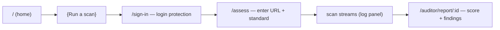
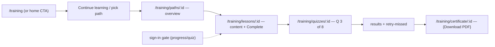
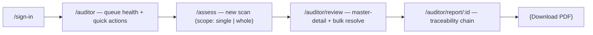
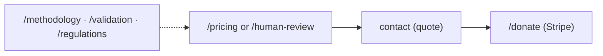
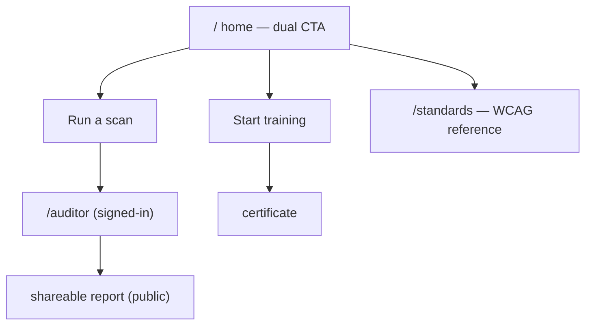

# 02b — User journey flows

Mermaid flows for the four primary journeys. Each step maps to a route in
`02-information-architecture.md`.

## Visitor → first scan (login-gated)

## Learner → certificate

## Auditor → report

## Buyer → human review / donation

## Cross-journey hub

