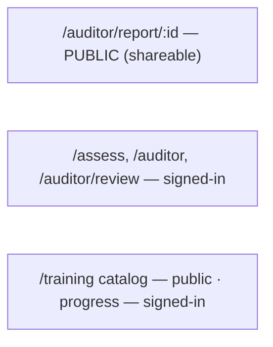

# Auditor wireframes (dense)

Density-first: KPI strips, full-column tables, master–detail always-on. Row height
24–28px, tabular numerals, no decorative whitespace.

## `/auditor` — workspace dashboard

```
┌─ Auditor workspace ─────────────────────────────────── ⌘K ─┐
│ Pending 23 │ Running 4 │ Failed 2 │ Done today 31 │ +12% Δ │  ← KPI strip (each = filter)
│ Views: [Failed awaiting review] [My outstanding] [+ Save]   │
│ ┌ Assessments ────────────────────────────────────────────┐ │
│ │☐ URL            Std  Scope Score Band SCs  Status Age Ow │ │
│ │☐ example.com    2.2AA site  87    Pass 41/42 done   2d SP│ │
│ │☒ gov.hk         2.2AA site  52    Fail 15/41 CT     5d SP│ │
│ │☐ a11yproject.com 2.2AA page 71   Pass 19/41 done   1d — │ │
│ │☐ dialogue-exp.hk 2.1AA site  64    Fail 22/40 fail   9d SP│ │
│ └──────────────────────────────────────────────────────────┘ │
│ [ Resolve 2 selected ▸ ]  [Re-run] [Delete]   (undo)        │
│ {New scan} → /assess · ⌘K search/commands · ? shortcuts      │
└──────────────────────────────────────────────────────────────┘
```

Density note: 8 data columns + checkbox column; score + band + SC counts shown
inline; each queue-health stat filters the table; bulk bar replaces the toolbar
when rows are selected.

## `/auditor/review` — review queue (master–detail, always-on)

```
┌─ Review queue ──────────────────────────────────────────────┐
│ Filters: [status▾] [standard▾] [age▾]  · Views: [Outstanding▾]│
│ ┌ list (DenseTable, multi-select) ─────────┬ detail ──────┐ │
│ │☐ URL            Std  CT  Age Owner  Claim│ SC 1.4.3     │ │
│ │☐ example.com    2.2AA 3   2d  —    [claim]│ Contrast (AA)│ │
│ │☒ gov.hk         2.2AA 7   5d  SP   claimed│ manual test… │ │
│ │☐ a11yproject.com 2.2AA 2   1d  —    [claim]│ evidence     │ │
│ │☐ esg.video      2.2AA 5   8d  —    [claim]│ [open report]│ │
│ │ (41 rows · ↑↓ sort)                       │              │ │
│ └───────────────────────────────────────────┴──────────────┘ │
│ [ Resolve N selected ▸ ] Passed/Failed/NotPresent + note      │
│ j/k next-prev · Enter claim · Esc close (restores focus)      │
└───────────────────────────────────────────────────────────────┘
```

Density note: CT column shows the number of Cannot-tell SCs per assessment (not a
word) so auditors triage by count; owner + claim state inline; panel shows the SC +
manual test + evidence without a modal.

## `/auditor/report/:id` — report (PDF download only)

```
┌─ {url} · WCAG 2.2 AA · whole website · 2026-08-21 ────────────┐
│ [Does not conform]  15/41 met  ·  87 score  ·  [Download PDF]  │
│ ┌ crit 2 ┐ ┌ serious 5 ┐ ┌ moderate 4 ┐ ┌ minor 1 ┐  ← severity│
│ ┌ ConformanceTable ───────────────────────────┬ findings ──┐ │
│ │ SC   Level Result   Machine  AI             │ button.btn  │ │
│ │ 1.4.3 AA    Failed   fail     —             │ → color-    │ │
│ │ 2.4.4 AA    CT       —        needs-review  │   contrast  │ │
│ │ 1.1.1 A     Passed   pass     —             │ → Perceiv-  │ │
│ │ …41 rows · filter [Failed][CT][AI]          │   able      │ │
│ └─────────────────────────────────────────────┴─────────────┘ │
│ Human-review checklist (12 Cannot-tell) → professional review  │
└────────────────────────────────────────────────────────────────┘
```

Density note: header packs URL + standard + scope + date on one line; severity is a
4-card KPI row; conformance table and the findings (traceability chain) sit side by
side on md+; every finding is one compact chain row (`element → rule → category → SC`).

## Gating boundary (R1-a)


