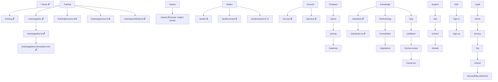

# Wireframe — 3-level sitemap

```mermaid
flowchart TD
  Home["/ Home 🔓"]

  Train["Training"]
  Assess["Assess"]
  Aud["Auditor"]
  Acct["Account"]
  Co["Company"]
  Know["Knowledge"]
  Sup["Support"]
  Auth["Auth"]
  Legal["Legal"]

  Train --> t0["/training 🔓"]
  Train --> t1["/training/paths 🔓"]
  Train --> t2["/training/lessons/:id 🔒"]
  Train --> t3["/training/quizzes/:id 🔒"]
  Train --> t4["/training/certificate/:id 🔓"]

  t1 --> p1["/training/paths/:id 🔓"]
  p1 --> m1["/training/paths/:id/modules/:mid 🔓"]

  Assess --> a1["/assess 🔒 (scope: single | whole)"]

  Aud --> w1["/auditor 🔒"]
  Aud --> w2["/auditor/review 🔒"]
  Aud --> w3["/auditor/report/:id ★"]

  Acct --> ac1["/account 🔒"]
  Acct --> ac2["/api-keys 🔒"]

  Co --> c1["/about"] --> c2["/pricing"] --> c3["/roadmap"]

  Know --> kn1["/standards 🔓"]
  kn1 --> sc["/standards/:sc 🔓"]
  Know --> kn2["/methodology"] --> kn3["/remediation"] --> kn4["/regulations"]
  Know --> kn5["/esg"] --> kn6["/validation"] --> kn7["/human-review"] --> kn8["/resources"]

  Sup --> sp1["/faq"] --> sp2["/contact"] --> sp3["/donate"]

  Auth --> au1["/sign-in"] --> au2["/sign-up"]

  Legal --> l1["/terms"] --> l2["/privacy"] --> l3["/sla"] --> l4["/refund"] --> l5["/accessibility-statement"]
```

Breadth note: every route is ≤ 3 levels deep — L1 = section, L2 = page, L3 = detail.
